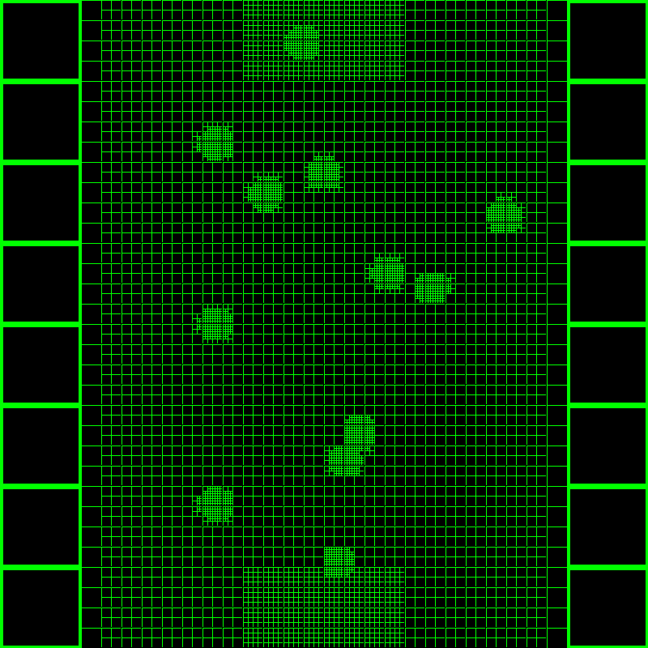

# multi_resolution_graph
### A performant multi-resolution graph implementation

## Current Applications
### UBC Thunderbots: *Robotic soccer player pathfinding*

### UBC Snowbots: *Sparse mapping for large scale mapping and pathfinding of autonomous groud-based vehicles* (WIP)
### simple_cfd: *One of my side projects, a 2d multi-resolution fluid simulator* (WIP)
